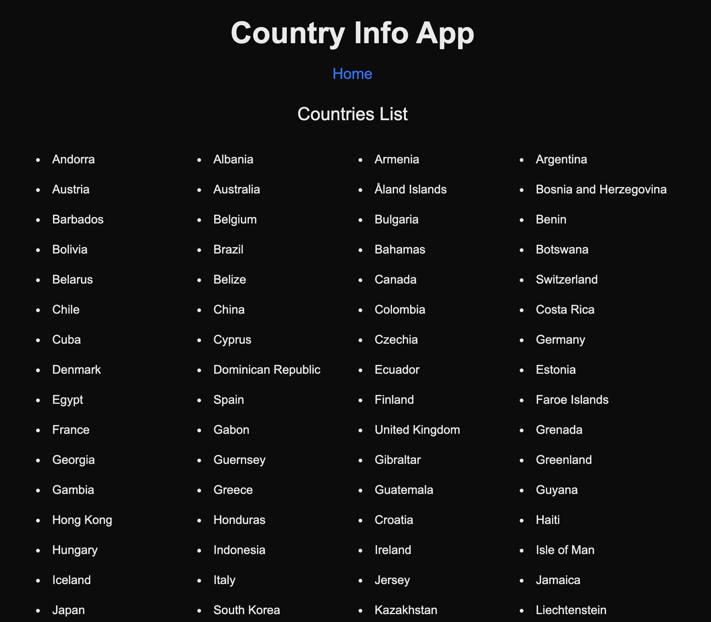
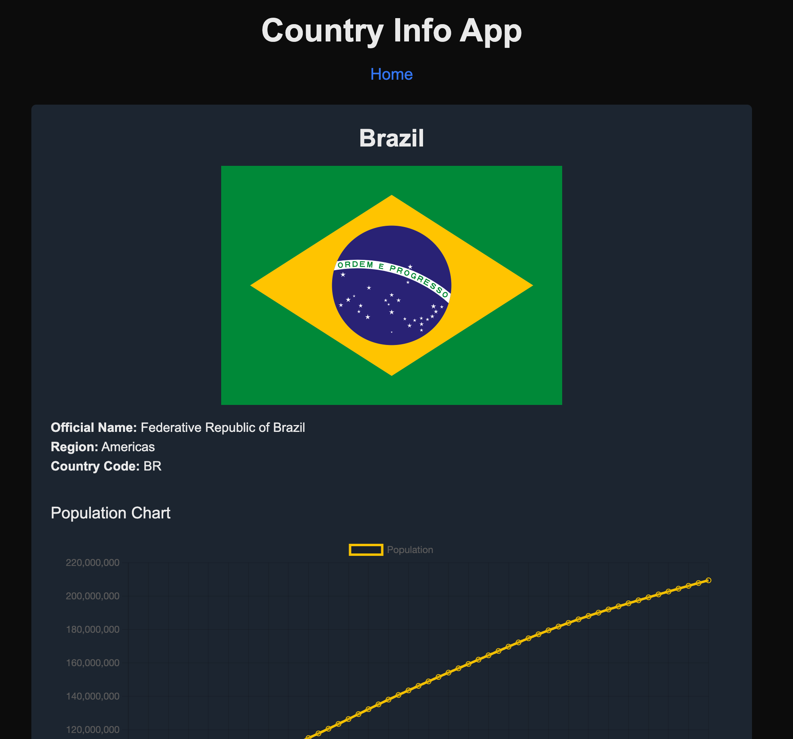
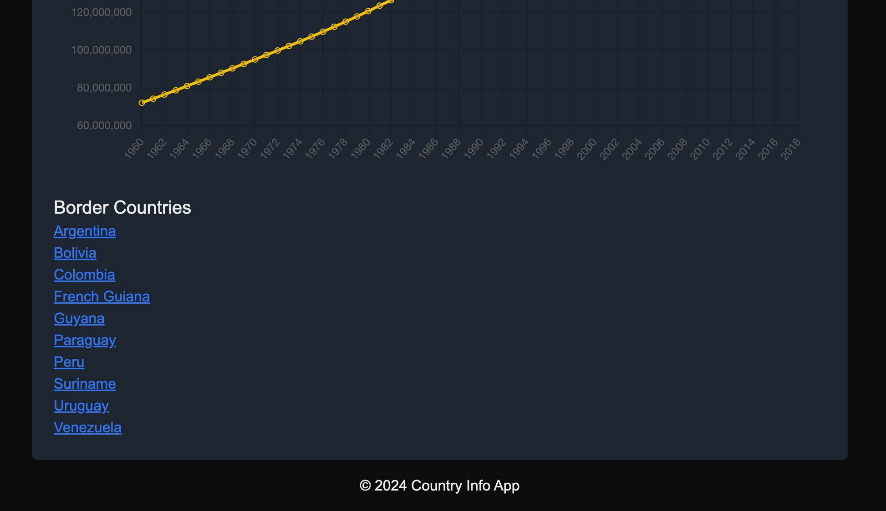

# Country Info App

## Overview

Country Info App is a full-stack application that allows users to explore detailed information about different countries, including population data, borders, and flags.





## Features

- **Country List:** View a responsive list of available countries.
- **Country Details:** Get detailed information about a selected country, including population history, bordering countries, and flag images.
- **Responsive Design:** Optimized for various screen sizes using Tailwind CSS.

## Technologies Used

- **Frontend:** React, Next.js, Tailwind CSS, Chart.js
- **Backend:** Node.js, Express, Axios
- **Others:** Vibrant for color extraction, dotenv for environment variables

## Installation

### Prerequisites

- Node.js installed on your machine.

### Frontend Setup

1. Navigate to the frontend directory:

   ```bash
   cd frontend
   ```

2. Install dependencies:

   ```bash
   npm install
   ```

3. Start the development server:

   ```bash
   npm run dev
   ```

### Backend Setup

1. Navigate to the backend directory:

   ```bash
   cd backend
   ```

2. Install dependencies:

   ```bash
   npm install
   ```

3. Start the server:

   ```bash
   npm start
   ```

## Usage

1. Ensure both frontend and backend servers are running.
2. Open your browser and navigate to `http://localhost:3000`.
3. Explore the list of countries and view detailed information by clicking on a country.

## License

This project is licensed under the MIT License.
